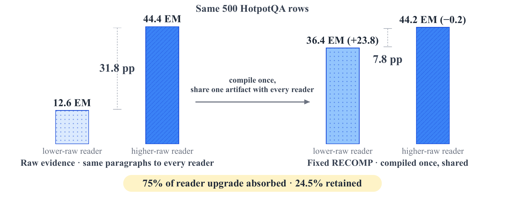
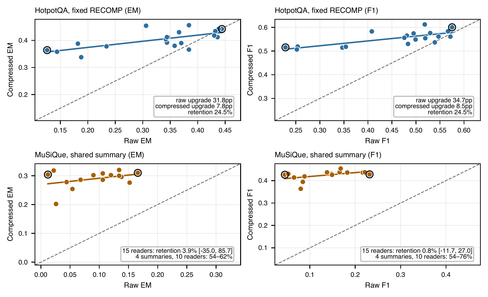
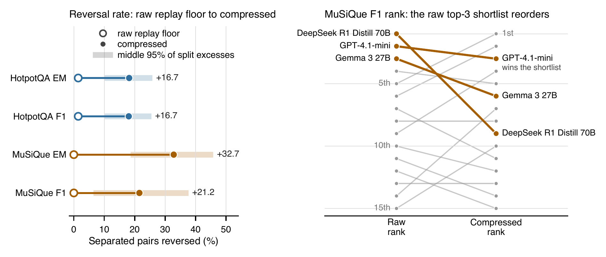

# ragscale

`ragscale` audits whether a deployed RAG compression layer preserves a reader
comparison. It keeps deployment utility separate from reader-upgrade fidelity:
a compressor can improve the current complete pipeline while hiding or
reversing an upgrade to a candidate reader.

The package accompanies *Compression Is Not Evaluation-Neutral: Fixed RAG
Compression Can Distort Reader Comparisons*. It also bundles the paper's
176,864-row interaction matrix.

## What the paper finds

RAG evaluations often compare readers (answer models) after a compressor has
already shortened or rewritten their evidence. That mixes two questions:

- **Deployment utility:** which complete pipeline scores best?
- **Upgrade fidelity:** how much of a reader upgrade survives the compressor?

The paper measures the second question directly. Within each panel, the
questions, candidate passages, prompt, and scoring rule stay fixed. The
compressor runs once per question, and every reader receives the same stored,
hash-checked compressed text. Each reader answers twice: once with the raw
candidate passages and once with that compressed text.

*Upgrade retention* is the compressed upgrade divided by the raw upgrade. A
10 pp raw upgrade that falls to 3 pp has 30% retention.

### One useful compressor hides most of a reader upgrade



On 500 HotpotQA questions, the lowest- and highest-scoring raw readers are
31.8 pp apart. Under one stored RECOMP output, they are 7.8 pp apart. RECOMP
raises the lower reader by 23.8 pp and changes the higher reader by -0.2 pp,
so 75% of the upgrade disappears. The compressor helps the weaker pipeline
without preserving the reader comparison.

### Lower raw-scoring readers gain more



Each point is one reader under raw and byte-identical compressed evidence. If
every reader gained the same amount, the points would sit on a line parallel
to the diagonal. Instead the curves flatten.

| Benchmark | Panel | Metric | Readers | Raw upgrade (pp) | Compressed (pp) | Retained (%) |
|---|---|---|---:|---:|---:|---:|
| HotpotQA | main | EM | 20 | 31.8 | 7.8 | 24.5 [-0.7, 37.9] |
| HotpotQA | main | F1 | 20 | 34.7 | 8.5 | 24.5 [5.0, 34.4] |
| MuSiQue | main | EM | 15 | 15.4 | 0.6 | 3.9 [-35.0, 85.7] |
| MuSiQue | main | F1 | 15 | 18.7 | 0.1 | 0.8 [-11.7, 27.0] |
| MuSiQue | four summaries | EM | 10 | 13.8 | 7.4-8.6 | 53.6-62.3 |
| MuSiQue | four summaries | F1 | 10 | 15.6 | 8.4-11.9 | 54.0-76.4 |

Brackets are family-by-row intervals for one stored artifact. HotpotQA and
MuSiQue are the main benchmarks, analyzed under a plan fixed in advance.

### Attenuation varies by compressor

Every panel with at least eight readers attenuates the upgrade, by different
amounts. Exact-match retention runs from 13.4% (NQ-Open, RECOMP top-5) to
83.6% (HotpotQA, EXIT); LongMemEval's semantic score reaches 4.5%. Average
gain and retention do not track each other. On HotpotQA, a shared summary
raises the panel mean by 13.6 pp but retains 18.1% of the upgrade. EXIT
raises the mean by 1.7 pp and retains 83.6%. An accuracy check alone cannot
tell you whether a compressor preserves a reader comparison.

Controls: choosing endpoints on one half of the questions and scoring on the
other still attenuates. On a twelve-reader LongMemEval panel, swapping in a
dense retriever changes 45.9% of the candidates but keeps 92.3% of the
upgrade, while fixed compression on the same panel keeps 53.8%.

### Reader pairs change order more often



Changing only the raw question half reverses a median 1.5% of eligible
HotpotQA pairs and none on MuSiQue. Compression adds 16.7 pp to the reversal
rate on HotpotQA, and 32.7 pp (EM) and 21.2 pp (F1) on MuSiQue. Of the
HotpotQA pairs that differ significantly under raw evidence (exact McNemar,
p < .05, 250 questions), only 41.7% still differ in the same direction under
compression; on MuSiQue, 27.6%. On MuSiQue F1, the raw winner is DeepSeek R1
Distill Llama 70B but the compressed shortlist winner is GPT-4.1-mini.

### Rescue and damage coexist inside the average

Compression *rescues* a raw-wrong answer when it becomes correct and *damages*
a raw-correct answer when it becomes wrong. On HotpotQA, 19.1% of row-reader
pairs are rescued and 35.7% of raw-correct pairs are damaged. On MuSiQue the
figures are 22.9% and 33.8%. The balance differs by reader, which is how a
higher average and a smaller upgrade coexist.

### What to do

For a declared reader change, run both readers on raw evidence and on the same
stored compressed text, and report how much of the upgrade survives. A
pairwise decision needs those two readers. A claim about a model family needs
a panel that spans the family: a three-reader shortcut (lowest, middle, and
highest raw scorer) caught only 1.9-8.5% of the broader panel's reversals.
`ragscale` runs this audit.

### Scope

Claims cover the observed readers, prompts, evidence policies, and stored
artifacts. Panels are nonrandom and exclude readers below 7B. There are no
production A/B logs or causal mechanism tests. A predictor fixed in advance
from raw reader spacing and compressor class did worse than raw spacing alone,
so each deployment still needs its own audit.

## Quick start

```bash
python -m pip install -e ".[dev]"
ragscale init --output my-audit
ragscale run my-audit/ragscale.yaml
```

The starter contains a YAML configuration, a JSONL evaluation set, and three
plain Python adapter functions. Replace those functions with wrappers around a
deployed compressor and the current and candidate readers.

### Key-only run

With only an OpenRouter or OpenAI key, the hosted preset runs the whole
pipeline on 100 bundled HotpotQA rows with no Python adapters:

```bash
export OPENROUTER_API_KEY=...
ragscale init --preset openrouter --output demo
ragscale run demo/ragscale.yaml
```

`--preset openai` does the same against `api.openai.com` with
`OPENAI_API_KEY`. The preset compiles one LLM summary per row, replays two
hosted readers under raw and compressed evidence, and writes the report to
`demo/audit/`. It is an illustration on one fresh summary draw. It is not
evidence about other readers or compressors, and the report header says so.
A committed run is in `examples/openrouter-hotpotqa/`.

A 100-row pair audit makes 100 compressor calls and 400 reader calls, plus
400 judge calls if a model judge is enabled. Calls run in parallel
(`run.workers`) and every answer is checkpointed to `call_cache.jsonl`, so an
interrupted run resumes without repeating calls.

The compressor runs once per item. `ragscale` stores a content hash for that
artifact, then passes the same compressed evidence to every configured reader.
Raw and compressed conditions use the same candidate pool and question.

The command writes:

- `summary.json`, the machine-readable audit;
- `REPORT.md` and `report.html`, the human report;
- `paired_scores.csv`, suitable for `replay-audit` or external analysis;
- `records.jsonl`, with scores, answers, hints, provenance, latency, tokens,
  and reported cost.
- `artifact_manifest.jsonl`, written after compilation and before reader
  replay, with candidate-pool and artifact hashes.

Teams that already have paired scores can skip execution:

```bash
ragscale replay-audit --input paired_scores.csv --metric exact_match --output audit/
```

`paired_scores.csv` holds one row per metric, so `--metric` names the one to
audit; a file with a single metric needs no flag. This command accepts two
readers or a larger panel. The result describes the
supplied readers only. No fixed reader count is treated as sufficient for
unseen readers.

## YAML configuration

```yaml
version: 1

dataset:
  path: eval.jsonl
  name: production-support-qa
  description: Held-out tickets sampled from the last quarter.
  hint_fields: [question_type, domain, difficulty, tenant]
  minimum_slice_rows: 20
  hints:
    source: production-shadow-eval
    language: en

pipeline:
  raw_policy_id: retrieved-candidate-pool-v3
  compressor:
    id: deployed-summary-v7
    callable: adapters:compress

readers:
  current:
    name: deployed-reader
    family: model-family-a
    callable: adapters:current_reader
  candidate:
    name: candidate-reader
    family: model-family-b
    callable: adapters:candidate_reader

comparison:
  current: current
  candidate: candidate

scoring:
  metrics: [exact_match, token_f1, token_precision, token_recall]

run:
  output_dir: audit
  bootstrap_draws: 2000
  minimum_raw_gap: 0.05
  retention_alert_threshold: 0.75
  workers: 8
  store_artifact_text: true
  reuse_artifacts: true
  reuse_answers: true
  fail_on_outcomes: []
  seed: 20260821
```

`workers` sets how many adapter calls run at once. `reuse_artifacts` reuses
compiled artifacts from `artifact_manifest.jsonl` and refuses to continue if
the candidate pool, raw evidence, or compressor configuration changed.
`reuse_answers` reuses reader and judge calls from `call_cache.jsonl`, keyed
by example, reader, condition, evidence hash, and adapter configuration.
`retention_alert_threshold` is a user setting for the report outcome label.
No threshold has been validated as a pass or fail rule.

Paths and adapter imports are resolved from the YAML directory. Add reader
entries for a fleet audit. The `comparison` block still names the current and
candidate readers used in the primary decision table.

For CI, list outcomes that should produce exit status 2 after the report is
written:

```yaml
run:
  fail_on_outcomes:
    - observed-order-reversed
    - observed-upgrade-attenuated
    - insufficient-raw-separation
```

## Dataset records and hints

Each JSONL line must contain:

```json
{
  "example_id": "ticket-1042",
  "question": "How long does a refund take?",
  "reference_answers": ["Five to ten business days"],
  "candidate_pool": [
    {"id": "policy-7", "text": "Refunds take five to ten business days."}
  ],
  "question_type": "policy_lookup",
  "domain": "billing",
  "difficulty": "easy",
  "tags": ["refund"],
  "hints": {"tenant": "north-america", "channel": "chat"}
}
```

`question_type`, `domain`, `difficulty`, and arbitrary hint fields are carried
into the audit. The report shows slice-level raw upgrade, compressed upgrade,
and retention when the slice meets `minimum_slice_rows`. Dataset-level hints
can record source, language, time window, intended use, or other context.

## Adapter contract

Adapters are ordinary Python callables. A compressor may accept any supported
subset of `question`, `documents`, `evidence`, `metadata`, and `case`:

```python
def compress(question, documents, metadata):
    text = deployed_compressor(question, documents)
    return {"text": text, "tokens": 412, "cost_usd": 0.0017}
```

A reader may accept any supported subset of `question`, `evidence`, `metadata`,
`case`, and `condition`:

```python
def candidate_reader(question, evidence, metadata, condition):
    answer = deployed_reader(question=question, context=evidence)
    return {"answer": answer, "tokens": 86, "cost_usd": 0.0021}
```

Adapters can return a string or a dictionary containing `text`, `answer`, or
`output`. Optional `tokens`, `cost_usd`, and `metadata` fields feed the resource
summary. Wall-clock latency is measured automatically.

### OpenAI-compatible endpoints

Use `type: openai_compatible` to call Chat Completions without writing Python
adapters. The API key is read from the named environment variable. Change
`base_url` to use OpenRouter, a self-hosted gateway, or another compatible
endpoint.

```yaml
pipeline:
  raw_policy_id: retrieved-candidate-pool-v3
  compressor:
    id: deployed-summary-v7
    type: openai_compatible
    model: provider/compressor-model
    base_url: https://openrouter.ai/api/v1
    api_key_env: OPENROUTER_API_KEY
    parameters:
      temperature: 0

readers:
  current:
    name: deployed-reader
    family: model-family-a
    type: openai_compatible
    model: provider/current-model
    base_url: https://openrouter.ai/api/v1
    api_key_env: OPENROUTER_API_KEY
  candidate:
    name: candidate-reader
    family: model-family-b
    type: openai_compatible
    model: provider/candidate-model
    base_url: https://openrouter.ai/api/v1
    api_key_env: OPENROUTER_API_KEY
```

Omit `base_url` to use `https://api.openai.com/v1` with `OPENAI_API_KEY`.
Optional fields include `system_prompt`, `user_prompt_template`, `headers`,
`timeout`, `max_retries`, and `parameters`. Prompt templates may use
`{question}`, `{evidence}`, and `{condition}`. The audit records the endpoint,
configured and returned model identifiers, serving provider when reported,
response ID, prompt hash, and token usage. It never writes the API key.

Set `temperature: 0` in `parameters` for every hosted adapter. Otherwise the
pair audit cannot separate reader noise from the compression effect. On
OpenRouter, `parameters.extra_body.provider` pins the serving provider so the
raw and compressed branches hit the same backend.

Reasoning models can spend the whole `max_tokens` budget on hidden thinking
and return no visible text. The adapter retries an empty reply twice
(`empty_retries`). A reader that still returns nothing is recorded as an
empty answer with `empty_response: true` in its metadata and scores zero. A
compressor or judge that returns nothing raises, because an empty artifact or
verdict would corrupt the audit. The OpenRouter preset disables reasoning in
the request and appends Qwen's `/no_think` switch to the compressor prompt,
since some providers ignore the request flag. Upstream rate limits are retried
with exponential backoff (`rate_limit_retries`).

Two assumptions are not checked by the package. The raw branch feeds the
joined candidate pool to the reader in the same prompt template as the
compressed branch; a team whose production raw path formats evidence
differently should rebuild it inside a Python adapter from `case`. The
compressor must not see which reader it serves; a reader-adaptive compressor
breaks the fixed-artifact design and the runner cannot detect it.

## Scoring

Built-in scorers are:

- `exact_match` or `em`;
- `token_f1` or `f1`;
- `token_precision`;
- `token_recall`;
- `rouge_l`;
- `answer_contains`.

Exact match and token scores use lowercase, punctuation, article, and
whitespace normalization and take the best score across reference aliases.

Lexical scores punish answer style as well as content. A reader that replies
in full sentences loses exact match to a reader that replies with the span,
and compression can change style as much as content. The default reader
prompt therefore asks for the answer span only. For readers that still
explain, add the model judge below or a custom scorer, and compare the
lexical and judged rows before reading rescue and damage.

Custom scorers use the same YAML list:

```yaml
scoring:
  metrics:
    - exact_match
    - name: grounded_correctness
      callable: my_metrics:grounded_correctness
```

The callable receives `prediction`, `references`, and `case`, and returns a
score in `[0, 1]`. This supports existing human labels, semantic judges, Ragas
metrics, or organization-specific release criteria without coupling the core
package to one provider.

### Model judge

For free-form answers, an OpenAI-compatible judge scores each answer 0 or 1
against the references:

```yaml
scoring:
  metrics:
    - exact_match
    - name: judge_match
      type: openai_compatible
      model: openai/gpt-4.1-mini
      base_url: https://openrouter.ai/api/v1
      api_key_env: OPENROUTER_API_KEY
      parameters:
        temperature: 0
        max_tokens: 4
```

The judge sees the question, the reference answers, and the prediction. It
never sees the evidence, so it cannot reward a compressed answer for matching
the compressed text. A reply that is not a 0/1 verdict raises an error rather
than becoming a silent score. Judge calls are cached like reader calls, and
the judge configuration is recorded under `provenance.adapter_provenance`.

## Interpretation

The primary report separates:

1. **Current compression gain:** compressed minus raw score for the current
   deployed reader.
2. **Upgrade retention:** the visible compressed current-to-candidate upgrade
   divided by the raw current-to-candidate upgrade.

Pair results are valid for the observed comparison. They do not screen a
broader fleet. Panel outputs describe the supplied panel, but `ragscale` does
not return `safe`, `neutral`, or another verdict about unseen readers or future
compressor draws.

## Bundled matrix

The paper's 176,864-row interaction matrix ships with the package:

```python
from ragscale import load_interaction_matrix

matrix = load_interaction_matrix()
```

`data/README_DATA.md` gives the column schema. The matrix records stored
binary outcomes per benchmark item, reader, and method label. A shared method
label does not prove two readers saw byte-identical compressed evidence, so
join the paper's artifact hashes before any fixed-artifact claim. The earlier
exploratory helpers that summarized this matrix (correlations, crossover
estimates, and a verdict string) were removed in 0.5.0.

## Installation

Install from a local checkout of this repository:

```bash
python -m pip install .
```

## Development

```bash
python -m pip install -e ".[dev]"
python -m pytest -q
python -m pip wheel . --no-deps --wheel-dir dist
```

The CLI has three commands: `init`, `run`, and `replay-audit`. The source is
split by stage: `config.py` loads the YAML, `execute.py` compiles artifacts
and replays readers, `analysis.py` computes the pair statistics, `reports.py`
writes the outputs, `presets.py` holds the starter projects, and `runner.py`
joins them. `replay.py` is the panel audit used for the paper validation; its
statistics are unchanged since 0.2.0, and 0.5.1 added only the metric selector.

## License

Code is released under Apache 2.0. The interaction matrix derives from
separately cited public benchmarks and stored model outputs. Benchmark content
remains subject to its source license and terms.
